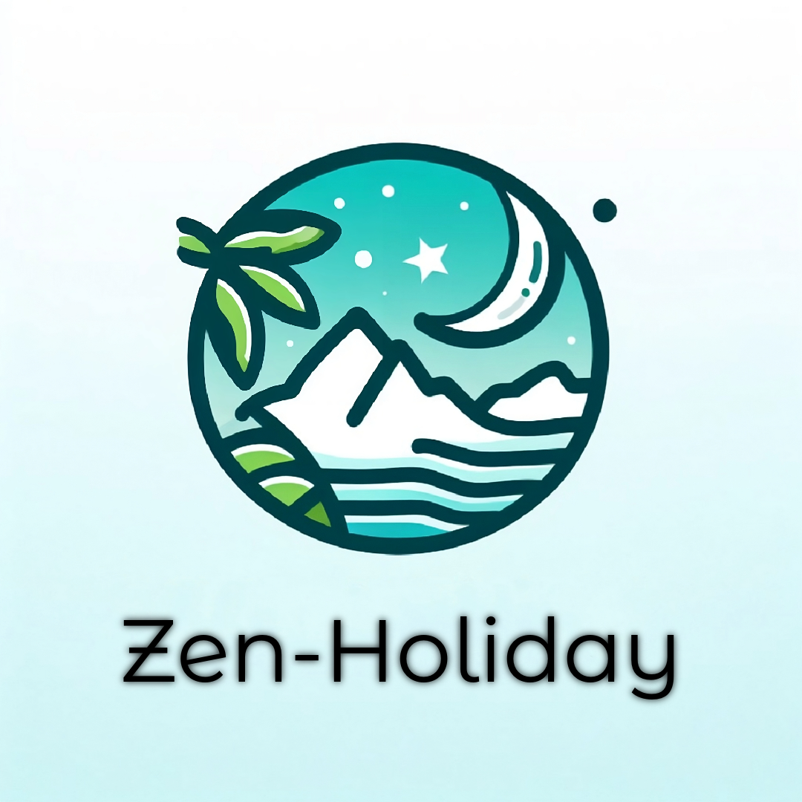

# CDA_EtapesPrint

Police d'écriture : Montserrat Alternates

## Palette de couleur

[Coolors](https://coolors.co/073b40-32c8bf-89cbc5-acdb92-87cf5c)

### Palette de couleurs\*\*

- **Couleur principale :** Midnight green (#073B40)
- **Couleur d'accent :** Robin egg blue (#32C8BF)
- **Couleur d'arrière-plan :** Blanc (#FFFFFF)
- **Couleur neutre :** Gris clair (#D3D3D3)
- **Couleur d'accent secondaire :** Mantis (#87CF5C)

### Utilisations suggérées

- **Texte principal :** Midnight green (#073B40)
- **Liens et boutons :** Robin egg blue (#32C8BF)
- **Arrière-plan :** Blanc (#FFFFFF)
- **Champs de texte :** Gris clair (#D3D3D3)
- **Éléments d'accent :** Robin egg blue (#32C8BF), Mantis (#87CF5C)

### Explication

- **La couleur principale, Midnight green, est une couleur riche et vibrante qui est idéale pour créer un impact.**
- **La couleur d'accent, Robin egg blue, est une couleur lumineuse et joyeuse qui est parfaite pour attirer l'attention.**
- **La couleur d'arrière-plan, Blanc, est une couleur polyvalente qui peut être utilisée pour créer un contraste ou pour ajouter de la profondeur.**
- **La couleur neutre, Gris clair, est une couleur polyvalente qui peut être utilisée pour créer un contraste ou pour ajouter de la profondeur.**
- **La couleur d'accent secondaire, Mantis, est une couleur audacieuse et vive qui peut être utilisée pour ajouter une touche d'originalité.**
